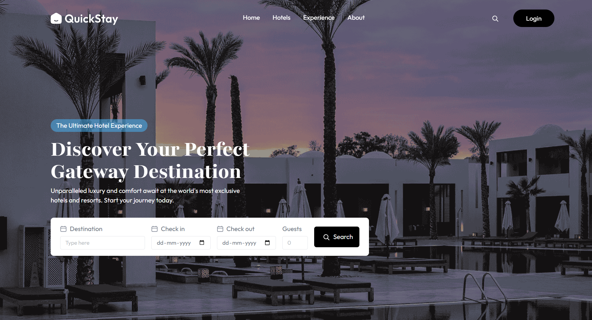
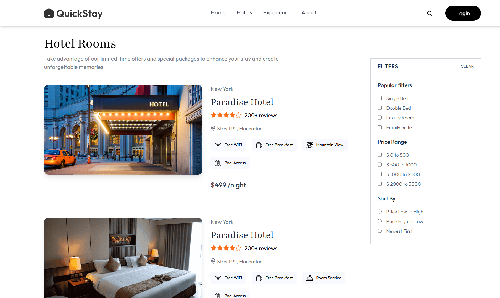
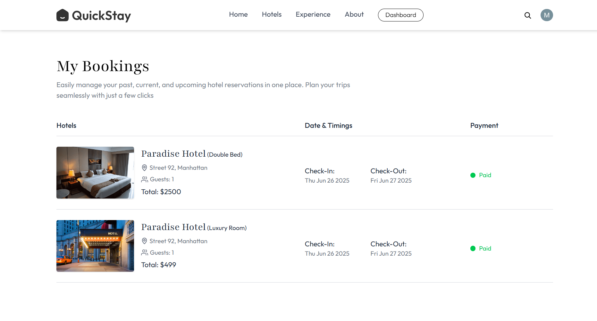

# 🏨 QuickStay – Modern Hotel Booking Platform  

**Discover, Book, and Manage Stays with Ease**  

QuickStay is a **full-featured hotel booking platform** built with the MERN stack, offering seamless booking experiences for travelers and powerful management tools for hotel owners. With secure payments, real-time availability, and beautiful dashboards, it's designed to be a **production-ready** solution.  

🚀 **[Live Demo](https://quickstay-three-self.vercel.app/)**

---

## ✨ **Key Features**  

### **For Travelers**  
🔍 **Browse Hotels** – Stunning listings with high-res images  
📅 **Real-Time Availability** – Instant booking confirmation  
💳 **Secure Checkout** – Powered by Stripe  
📧 **Booking Confirmations** – Delivered via Brevo  
📱 **Mobile-Friendly** – Book on any device  

### **For Hotel Owners**  
🏢 **Property Management** – Add & update rooms effortlessly  
📊 **Revenue Dashboard** – Track bookings & earnings  
🔄 **Instant Updates** – Sync availability in real-time  
📸 **Cloudinary Integration** – Upload property photos easily  

### **Tech Highlights**  
⚡ **Blazing Fast** – Vite + React optimized for performance  
🛡️ **Secure Auth** – Clerk-powered authentication  
📈 **Analytics** – Vercel Insights for performance tracking  
🌐 **Responsive UI** – TailwindCSS for a sleek experience  

---

## 🛠️ **Tech Stack**  

| **Category**       | **Technologies**                         |
|--------------------|------------------------------------------|
| **Frontend**       | React (Vite), TailwindCSS                |
| **Backend**        | Node.js, Express.js                      |
| **Database**       | MongoDB (Mongoose ODM)                   |
| **Authentication** | Clerk                                    |
| **Payments**       | Stripe                               |
| **Emails**         | Brevo (Sendinblue)                       |
| **Media Storage**  | Cloudinary                               |
| **Hosting**        | Vercel (Serverless)                      |
| **Monitoring**     | Vercel Analytics & Speed Insights        |

---

## 📸 **Sneak Peek**  

<h3><strong>Homepage – Find Your Perfect Stay</strong></h3>  

  

<h3><strong>Book Rooms – Secure & Simple</strong></h3>  

  

<h3><strong>Owner Dashboard – Manage Your Business</strong></h3>  

  

<h3><strong>User Booking History</strong></h3>  

  

---

## 🚀 **Why QuickStay?**  

This project demonstrates:  
✅ **End-to-end SaaS architecture**  
✅ **Production-grade payment flows**  
✅ **Dynamic dashboards with real-time data**  
✅ **Optimized media handling**  
✅ **Scalable backend design**  

---

## ⚠️ **Disclaimer**  

This is a **portfolio project** for educational purposes only. No real transactions or bookings are processed.  

## 📬 **Connect & Contribute**  

🔹 **Found a bug?** Open an issue!  
🔹 **Want to improve something?** Submit a PR!  
🔹 **Need help?** Reach out via GitHub discussions.  

---

⭐ **Love this project? Give it a star!** ⭐  

---

### 🏆 **Built with Passion, Shared with the Community**  
*"Travel should be easy. Booking should be effortless."* 
